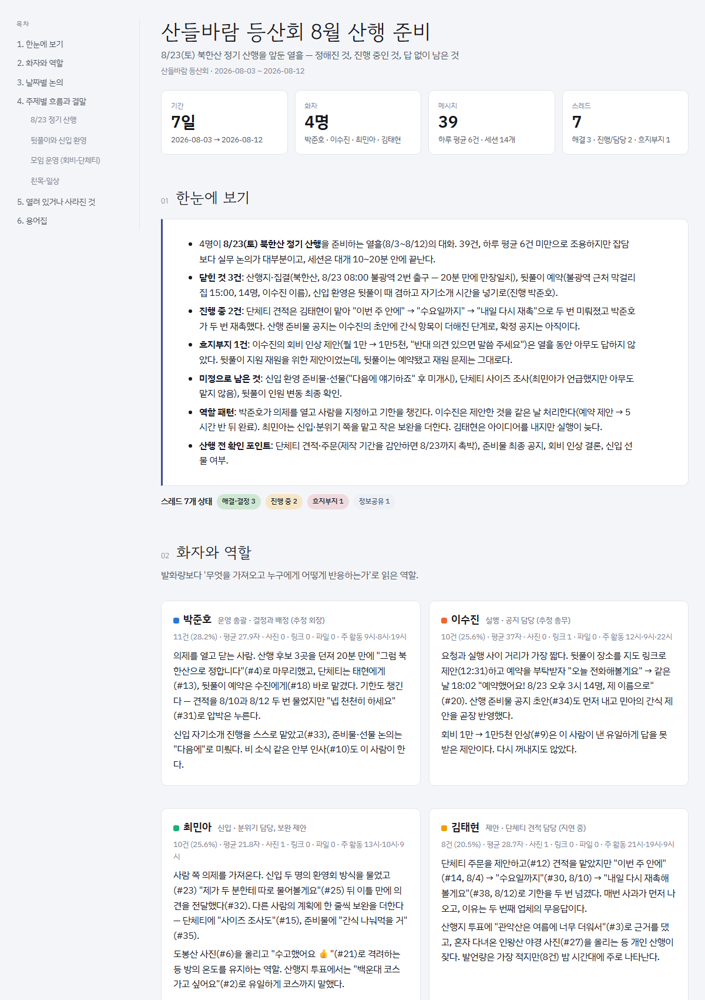

# claude-skills

Claude Code용 스킬 모음입니다. 스킬 하나가 폴더 하나이고, 각 폴더에 `SKILL.md`(Claude가 읽는 절차)와 필요한 스크립트·참고 문서·예시가 들어 있습니다.

## ASC 3강: 오픈소스로 에이전트 업데이트

2강의 Skill·Subagent를 tiktoken·RapidFuzz·ajv로 업데이트했습니다. 실제 대화 11,341줄로 돌려 나온 실패(인용 줄 번호 드리프트 16건, 줄 누락 1건, 상태값 오타 2건)가 근거입니다.

- **[과제 설명 및 변경 내역](ASC-LESSON03.md)**
- **[업데이트 실행 결과](asc-lesson02-kakao-review/runs/test-03/)** · **[최종 보고서](asc-lesson02-kakao-review/runs/test-03/06-final-report.md)** · **[변경 전후 diff](asc-lesson02-kakao-review/runs/test-03/00-diff.txt)**
- [다운로드용 ZIP](asc-lesson03-update.zip)

인용 줄 번호 드리프트는 1.3%에서 0%가 됐고, 검증이 보고서 작성 후 1회에서 분석·검토·최종 3회 관문으로 바뀌었습니다.

## ASC 2강: Subagent 분석·검토

- **[2강 파일 폴더 바로 보기](asc-lesson02-kakao-review/)**: Subagent 2개, Skill, 합성 예제, 실제 프롬프트·응답을 파일별로 확인합니다.
- **[과제 설명 및 빠른 링크](ASC-LESSON02.md)**
- **[최종 보고서](asc-lesson02-kakao-review/results/final-report.md)** · **[판단 조율 기록](asc-lesson02-kakao-review/results/coordination.md)**
- [다운로드용 원본 ZIP](asc-lesson02-kakao-review.zip)은 그대로 유지합니다.
- 이 폴더의 Skill·Subagent는 [3강](ASC-LESSON03.md)에서 업데이트됐습니다. 2강 제출 시점 상태는 위 ZIP에 그대로 있습니다.

이 폴더는 Claude Code용 프로젝트입니다. 일반 Claude 채팅에 ZIP을 스킬로 등록하는 방식과 다릅니다. 보관된 실제 실행은 Aside Subagent 환경이며 이 제출본은 Claude Code 재실행 검증을 포함하지 않습니다.

## 스킬 목록

| 스킬 | 무엇을 하나 | 상세 |
|---|---|---|
| **kakao-chat-analysis** | 카카오톡 대화 내보내기(.txt)를 처음부터 끝까지 읽고 "누가, 무슨 논의를, 어떻게 진행했고, 어떻게 끝났는지"를 HTML + PDF 보고서로 정리 | [skills/kakao-chat-analysis/README.md](skills/kakao-chat-analysis/README.md) |

## 결과 미리보기

kakao-chat-analysis가 만든 보고서입니다. 가상의 등산 동호회 대화 39건(합성 데이터)으로 만들었습니다.



- 웹페이지로 보기: https://lumin-on.github.io/claude-skills/samples/kakao-chat-analysis/report.html
- PDF로 보기: [report.pdf](docs/samples/kakao-chat-analysis/report.pdf)
- HTML 원본: [report.html](docs/samples/kakao-chat-analysis/report.html)

GitHub는 저장소 안의 HTML 파일을 클릭하면 소스 코드로만 보여줍니다. 위의 "웹페이지로 보기" 링크가 동작하려면 저장소 **Settings → Pages → Build and deployment → Source: Deploy from a branch → `main` / `/docs`** 로 한 번 설정해야 합니다. 몇 분 뒤부터 `docs/` 안의 HTML이 웹페이지로 열립니다. PDF 링크는 설정 없이 GitHub 뷰어에서 바로 열립니다.

## 어떤 AI에서 쓸 수 있나

이 저장소의 스킬은 Anthropic의 **Agent Skills** 형식(`SKILL.md` + 부속 파일)으로 쓰여 있습니다.

| 환경 | 사용 |
|---|---|
| Claude Code (터미널·데스크톱 앱·VS Code 확장) | 폴더를 스킬 디렉터리에 복사하면 바로 동작 |
| Claude 앱 (claude.ai 웹·데스크톱) | 스킬 폴더를 zip으로 묶어 설정 → 기능 → 스킬에 업로드 (유료 플랜) |
| ChatGPT·Gemini·Cursor·Codex 등 | 스킬 형식은 인식하지 못함. 스크립트는 독립 실행되며, `SKILL.md`를 프롬프트로 주면 절차를 따라 하게 할 수 있음 |

각 스킬의 README에 해당 스킬의 지원 범위와 요구 사항을 따로 적어 두었습니다.

## 설치

```bash
git clone https://github.com/lumin-on/claude-skills.git
```

또는 **Code → Download ZIP**.

원하는 스킬 폴더만 스킬 디렉터리에 복사합니다.

- 특정 프로젝트에서만: `<프로젝트>/.claude/skills/<스킬이름>/`
- 모든 프로젝트에서: `~/.claude/skills/<스킬이름>/` (Windows는 `C:\Users\<이름>\.claude\skills\`)

```bash
mkdir -p ~/.claude/skills
cp -r claude-skills/skills/kakao-chat-analysis ~/.claude/skills/
```

Claude Code를 다시 열면 스킬 목록에 나타납니다. 스킬은 사용자의 요청이 `SKILL.md`의 설명과 맞을 때 Claude가 스스로 불러오며, `/kakao-chat-analysis`처럼 이름으로 직접 부를 수도 있습니다.

## 저장소 구조

```
claude-skills/
├── README.md                 # 이 파일: 컬렉션 소개와 스킬 목록
├── .gitignore
└── skills/
    └── kakao-chat-analysis/  # 스킬 하나 = 폴더 하나
        ├── SKILL.md          # 필수. 언제 쓰는지(설명)와 절차
        ├── README.md         # 사람이 읽는 상세 설명
        ├── references/       # Claude가 필요할 때 읽는 참고 문서
        ├── scripts/          # 결정적 작업을 맡는 스크립트
        ├── assets/           # 예시·템플릿
        └── evals/            # 테스트 프롬프트와 합성 샘플
```

새 스킬을 추가할 때는 `skills/<이름>/SKILL.md`를 만들고 위 표에 한 줄을 더합니다.

## 원칙

- 스킬 폴더에는 **실제 개인 데이터를 넣지 않습니다.** 예시와 테스트는 모두 합성 데이터입니다.
- 1강 스킬은 Python 표준 라이브러리, 2강 검증 실험은 Node.js 표준 라이브러리를 사용합니다. 외부 패키지가 필요하면 해당 README에 명시합니다.
- 결과물(보고서·작업 폴더)은 `.gitignore`로 제외돼 있습니다.
